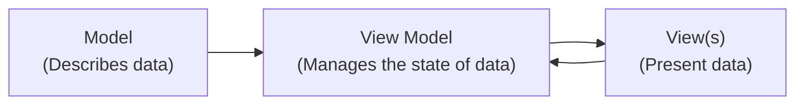

---
{"dg-publish":true,"permalink":"/tutorials/creating-a-to-do-list-app-part-5/","dgHomeLink":true,"dgShowToc":true}
---


# Creating a To-do List App, Part 5

In [[Tutorials/Creating a To-do List App, Part 4\|part four]] of this task, you improved the to-do list app so that you could use Xcode Previews again. You could test a single view in Xcode Previews, and data would not be persisted. You could run your app in the Simulator or on a physical device, and data *would* be persisted – saved to a database file – by the SwiftData framework.

Using SwiftData to persist data is a good choice when the user of your app is the only person who will ever need to see that data. Data is persisted directly on the user's device, so it is kept very secure. Moreover, there is virtually no latency, as writing data to an SSD is very fast.

However, there are situations where the data created by one user in an app needs to be seen by another user of that app.

In these situations, we can persist data within a database stored "in the cloud", and configure our database to share data between users, as needed.

By the way – the term "cloud computing" just means that somewhere, a computer kept in a facility referred to as a "server farm" is running the database software.

A server farm is a building that contains many computers, usually all connected to the Internet.

Here is a photo of a rack of servers, kept within a server farm:


<small><div class="o2HfV xP9Y2"><span class="U665a FEdrY EZz41">Photo by <a href="https://unsplash.com/@wildmax?utm_content=creditCopyText&amp;utm_medium=referral&amp;utm_source=unsplash">Massimo Botturi</a> on <a href="https://unsplash.com/photos/electronic-wire-lot-zFYUsLk_50Y?utm_content=creditCopyText&amp;utm_medium=referral&amp;utm_source=unsplash">Unsplash</a>
  </span></div></small>

As app developers, by using frameworks, or third-party libraries, we can make use of cloud-hosted databases relatively easily.

In this tutorial, you will begin to learn how to use [Supabase](https://supabase.com) within an iOS project to store data in a cloud-hosted database.

## Obtain the starting point project

Rather than make further changes to the version of your to-do list app that writes data to a local database using SwiftData, it will be easier to return to the version of the app that kept to-do items in memory, and then edit the code from that point.

So, you can [download this file](https://www.russellgordon.ca/russellgordon.ca/lcs/2023-24/ics3u/Todo-CloudDatabase.zip).

Once downloaded, you may need to double-click the `zip` file to de-compress it:


Then open the `Todo-CloudDatabase` folder, and double-click the blue `.xcodeproj` file:


Xcode will open, and you should see something like this:


Try out the app. You should see that you can add to-do items, edit them, delete them, and toggle their completion status. 

### Create a local repository

Before continuing, it's important to enable source control.

If you open the **Source Control** navigator, then click on **Repositories** tab, you will notice that there is no local repository:


To fix this, select the menu sequence **Integrate > New Git Repository...**:


Then click the **Create** button:


### Create the remote repository

Once that is done:

1. Expand the disclosure triangle for the `Todo-CloudDatabase` local repository. 
2. Expand the disclosure triangle for the `Remotes` folder.
3. Two-finger tap or right-click and choose the option to create a new remote.

Like this:


When the next dialog appears, you can leave the default options, then press the **Create** button:


You should see that the remote has been created:


## Separation of Concerns

We have previously learned that it is ideal to keep [[Concepts/Separation of Concerns\|model code separated from view code]].

A **view** is anything a user sees within an app and interacts with – it's job is to *present* data.

A **model** is a representation of the data your app needs to work with.

However... at present, in almost every program we have written so far, the *state* of model data – how many to-do items there are, how many landmarks are shown in a list – has lived within the view.

When we want to perform a CRUD operation (create, read, update, or delete some data) the *code to make that happen is in the view*.

As our programs grow in size, that can become a problem. It can lead to:

- overly long views (too many lines of code)
- duplication of code (when modifying an instance of a data type, the code to do this in different views might look practically identical)

### The MVVM design pattern

So, there is a *software design pattern* known as MVVM, which stands for **Model-View-ViewModel**.

Model and view code work exactly as you already understand them to.

When we introduce a **view model**, it takes over the job of managing the *state* of the data that is described by our model. The view model also manages the actual work of creating, reading, updating, or deleting data on behalf of views within an app.

A single view model might be used by many views within an app.

Visually, and in general, that looks like this:



If necessary, the view model creates an initial, empty instance of whatever data structures are described by the model. Or the view model might load existing instances of data (for example, from a database).

The view model provides instances of data to view(s) in an app. As needed, views call upon the view model to create, read, update, or delete data on their behalf.

A view model's job is very similar to the job that the [[Tutorials/Creating a To-do List App, Part 3#The context\|model context performs when using SwiftData]].

Let's look at how this can be applied within the to-do list app we have been developing.

### Create the view model

First, create a group named `ViewModel` in your project:


Then create a new Swift file named `TodoListViewModel` inside that group:


> [!TIP]
> 
> Take care to match the spelling and capitalization shown in these examples. It will make it easier to read your code later on.

Now press this button to add another editor on the right side of your Xcode window:


Then arrange the windows such that `LandingView` is open on the right, and `TodoListViewModel`  is open on the left:


Copy and paste the following code into `TodoListViewModel`:

```swift
import Foundation

@Observable
class TodoListViewModel {
    
    // MARK: Stored properties
    // The list of to-do items
    var todos: [TodoItem]
    
    // MARK: Initializer(s)
    init(todos: [TodoItem] = []) {
        self.todos = todos
    }
    
    // MARK: Functions
    func createToDo(withTitle title: String) {
        
        // Create the new to-do item instance
        let todo = TodoItem(
            title: title,
            done: false
        )
        
        // Append to the array
        todos.append(todo)
        
    }
    
    func delete(_ todo: TodoItem) {
        
        // Remove the provided to-do item from the array
        todos.removeAll { currentItem in
            currentItem.id == todo.id
        }
        
    }
    
}
```

... like this:


Big picture, this places all of the code related to tracking the state of to-do items, and any code connected to modifying to-do items data, into the `TodoListViewModel` class.

Let's briefly examine a few key lines of code in more detail:


1. The `@Observable` keyword indicates that SwiftUI should watch any instances of the view model, so that when data changes, the user interface is updated.
2. The list (array) of to-do items, `todos`, is moved inside the view model.
3. `TodoListViewModel` is a class, so it must have an initializer.
4. The functions to create and delete a to-do item are copied directly from what is currently in the `LandingView` file.

Our next job is to remove the code that manages data from the *view*, and instead make use of the *view model* to do that work.

This is important progress, so be sure to commit and push your work at this point using the following message: 

```
Added a view model to manage state within the app, and handle CRUD (create, read, update, delete) operations.
```

### Use the view model

Now we will make modest edits to use the view model within the `LandingView` view.

First, where the `todos` array is currently created:

```swift
// The list of to-do items
@State var todos: [TodoItem] = exampleItems
```

...instead create an instance of `TodoListViewModel`:

```swift
// The view model
@State var viewModel = TodoListViewModel()
```

... like this:


On line 21 in `LandingView`, the source of truth for data within the app – an instance of the view model – is now created.  This means the initializer function – on lines 18 to 20 in `TodoListViewModel` – is run. In turn, the initializer of the view model creates an empty array of to-do items.

We will fix the error on line 29 in `LandingView` in a moment.

First, scroll down to the functions that still exist in `LandingView`:


Highlight both functions:


... and delete them:


This is all OK, because earlier, we moved the functions over to the view model:


Now, all we need to do is make the code in the view actually use the instance of the view model that we created a moment ago.

Scroll up in `LandingView` to around line 29:


Change the code:

```swift
List($todos) { $todo in
```

... to:

```swift
List($viewModel.todos) { $todo in
```

... like this:


That causes the `List` structure to use the `todos` array that is now inside the view model, instead of trying to use the `todos` array that was previously part of `LandingView` directly (recall we deleted it a moment ago).

Finally, scroll down a bit further to where the the `delete` function and `createToDo` functions are invoked:


Since those functions are part of the view model, we can access them by simply prepending `viewModel.` in front of the function names, like this:


... and this:


Now, try out the app again. You should see that as before, you should see that you can add to-do items, edit them, delete them, and toggle their completion status:


Now, you might be wondering – nothing in the way the app works has changed! This was a waste of time! Not so – the number of lines of code in the view has been reduced by nearly 40%.

Additionally, making use of a view model sets us up to keep the code that communicates with the cloud-hosted database entirely separate from the code that creates our user interface – the views. We are separating the major pieces of functionality within our app, and this a Good Thing.

Be sure to now commit and push your code, using this message:

```
Made use of the view model within our view to manage state.
```

## Supabase

Supabase is a company that offers cloud-hosted databases that can be integrated within apps developed on a wide variety of platforms – not just iOS.

### Create an account

To begin using this service, you must first create an account. This is a one-time-only requirement, and you can make use of your existing account on GitHub to use Supabase.

So, first, [follow this link to sign in to GitHub](https://github.com/login) using your existing account.

Then, [sign in at Supabase](https://supabase.com/dashboard).

You should see an interface something like this:


Select **Continue with GitHub**.

You will then see this:


Select the green **Authorize supabase** button.

After a moment, you will be logged in to Supabase, and presented with this screen:


> [!TIP]
> 
> Do not worry if you briefly see a message at top right that says `Failed to create your profile.` That will go away after a moment, and does *not* impact your ability to use the service, in any case.

### Create a new project

Begin by clicking either one of the green **New Project** buttons:


The first time you create a project, you will be prompted to create an organization:


Type `Lakefield College School` for the **Name** field and then select `Educational` for the **Type of organization** dropdown, then click **Create organization**:


After a moment, you will be brought to this screen to create a new project:


Make the following selections – and – **very important** – be sure to copy and save the database password in a safe place on your own computer – you **must** be able to find this password later on:


You will then see something like this screen – it may take a few minutes to set up your project:


After a little while, the screen will change to the following:


You are ready to create a table in your cloud-hosted database!

### Create a table

Select **Table Editor** button:


Then press the green **Create a new table** button:


Name the table `todos`:


Add a description of `Holds all the to-do items saved by users in my app`:


Then select the checkbox to *disable* row-level security:


You will get a pretty stern warning about this choice – do not worry – this is only temporary, while we are learning – so go ahead and select the green **Confirm** button:


You will then see the following:


Scroll down a bit to the **Columns** section:


You are going to add columns that match the properties of the `TodoItem` structure in your Xcode project:


So, first, delete the `created_at` column:


Leave the `id` column as is.

Add a `title` column:


Then add a `done` column:


Make sure the spelling of the column name, and the related data type, match what is shown above.

Then click the green **Save** button.

You should see an interface like the following:


You are all set to begin creating data in your database and interacting with it from your Xcode project.

However... that will have to wait for part 6 of this tutorial... in tomorrow's class. 😮‍💨